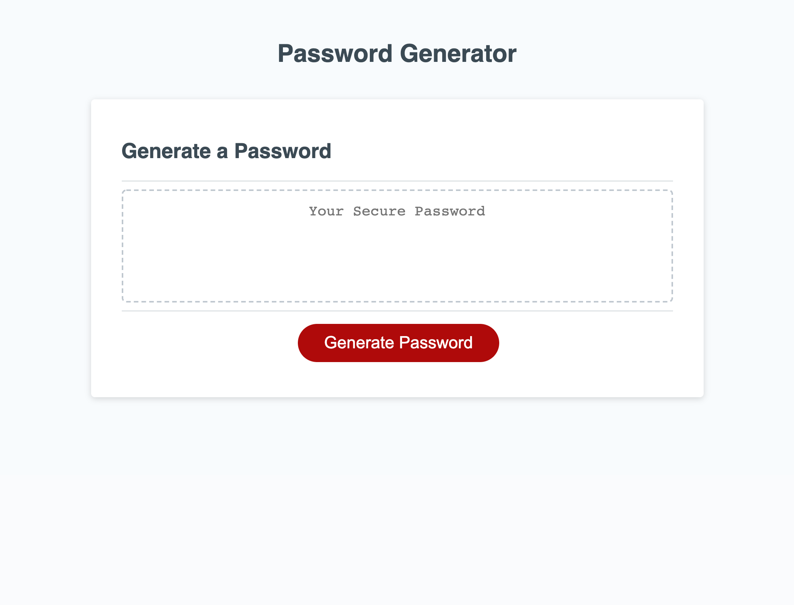
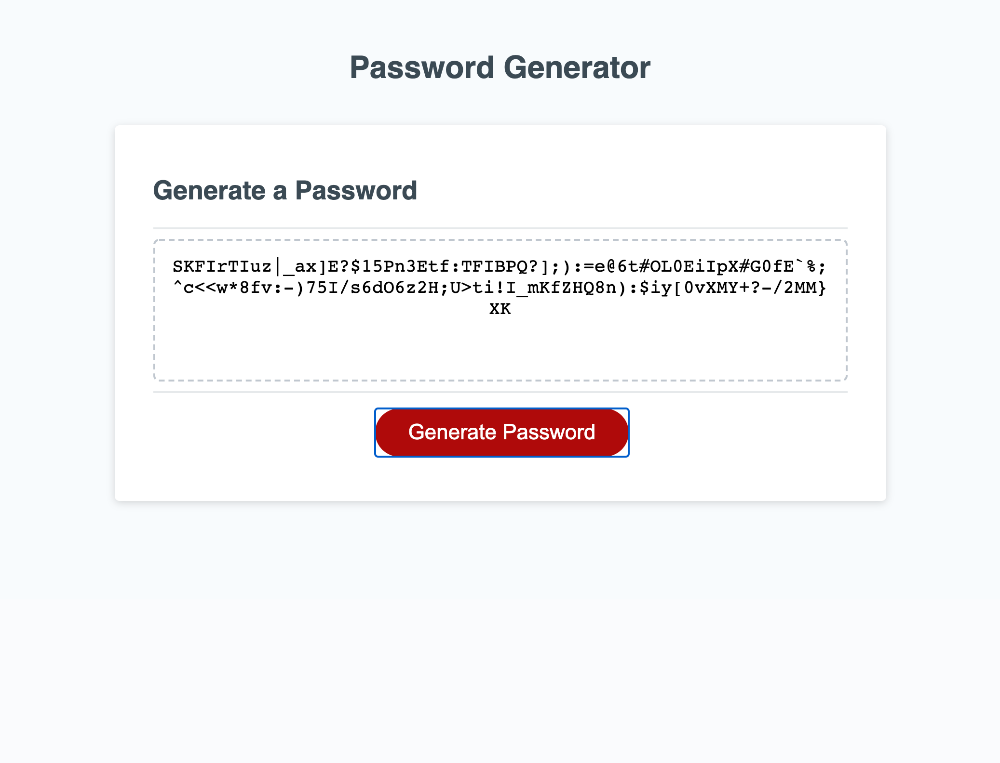

# Password-Generator-Application
Generate random passwords based on user criteria selected.

## Description
This is a web application that enables the user generate random passwords based on the criteria they have selected including special characters, numbers, lowercase alphabets and uppercase alphabets. This application is run on the brwoser and is powered by Javascript code.
The Javascript code provides a clean, polished and responsive user interface that adopts to multiple screen sizes.

## User Guide
This section provides detailed description on how to use the password generator app:

When the red "Generate Password" button is clicked, a prompt is displayed asking the user for the preferred length of the password. If the value enter is a stringor letter, an alert message is displayed requesting the user for a valid entry. Consequently, if the user enters a range outside the 8-128 recopmmended  range, an alert message is displayed again  to request for a valid entry.

When the user enters a valid number between 8 to 128, the window prompts the user to select a acriteria, i.e. whether they want to include numbers, special characters, lowercase or uppercase letters. The user must select at least one criteria else the app prompts the user before it is moves to the  next step.

When the user has successfully selected and defined  their criterias, the password will be randomly calculated and displayed.

## Links to deployed application
* URL of deployed application: https://e-giftz.github.io/Password-Generator-Application/

* URL of GitHub repository containing the code: https://github.com/e-giftz/Password-Generator-Application

## Screenshots of Web App

## Password Generator App Demo

